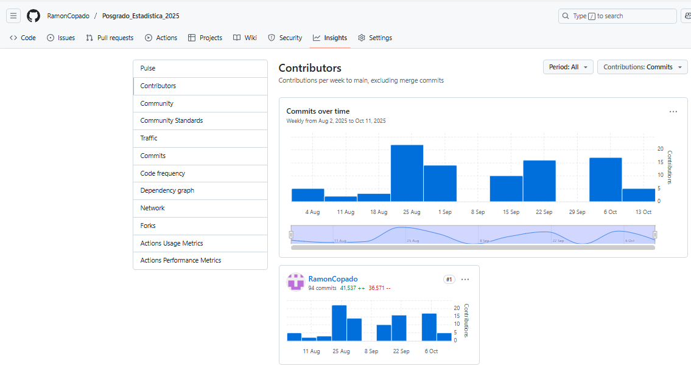

# Posgrado Estadistica 2025 
 
  + # Material del curso de Posgrado del programa DMRN
  + # Estadística en la investigación científica

## Contenido del curso (8 semanas 07/08/2025 - 02/10/2025)

**Semana 1** (07/08/2025): Inicio del curso :fire: :smiley:
  + Crear repositorio
  + Sincronizar nube y computadora
  + Credenciales Git
  + Sinc

**Semana 2** (14/08/2025) Script2. Laboratorio 1

  + Nos oriento el Dr. Marco Gzz. para hacer lo siguiente:
  + Alt - para operar asignacion
  + Operadores R abs, sqrt, log
  + usar # Para comentarios
  + Se empezó a realizar Laboratorio 1
  + Ejercicio yo solo graficar y ponerle nombres a títulos de gráficos
  + Crear el gráfico de barras con nombres
  + Manera de hacerlo en clase
  
   
**Semana 3** (21/08/2025) script3.  Ejercicio-Temperatura

  + Importamos desde excel el archivo Temperatura de excel
  + Importamos desde la página de gobierno un archivo .CSV
  + Nos mostro diferentes tipos de graficas
  + Inspeccionar mi objeto temperatura
  + head(temperatura) observamos las Primeras 6 filas y encabezado
  + dim(temperatura) visualizamos el numero de filas y columnas
  + names(temperatura) Cambiamos los nombres de las columnas
  + str(temperatura), dataframe, para mostrar informacion detallada sobre el objeto
  + summary(temperatura) para hacer un resumen estadistico
  + names(temperatura) <- c("") para corregir nombres de columna
  + temperatura$media_anual <- rowMeans(temperatura [,2:13],1) head(temperatura) esto determinar medias por columnas y filas determinadas por los parentesis
  + colores<-c("navajowhite","salmon","skyblue") para indicar que colores queremos en la grafica
  + boxplot(temp,col=colores,main="Comportamiento temperatura (2000 a 2020)",xlab="Meses",ylab=
  + Importamos datos desde web
  

**Semana 4** (28/08/2025) Script-4_Calidad_Plantula

  + Importar desde página de Dr. Marco archivo excel Caliadad de plantula
  + Sacar medias 
  + Sacar desviación estandar
  + Sacar varianza
  + Hacer grafica con diferentes colores
  + Poner titulo y nombres al eje de x,y
  + Observamos datos por conjunto para ver normalidad
  + Pruebas de normalidad Shapiro
  + Revisar Homogeneidad
  + Prueba de T
  + Un clasico error estadistico
  + Medir el efecto del efecto
  + Identificamos Hipotesis nula, Alternativa
  
  
**Semana 5**(04/09/2025) Contraste_de_medias-iris
  + Media movil, muestra media general 
  + Contraste de medias
  + H0 La diferencia de ambas especies es 0
  + H1 La diferencia de ambas especies es diferente a 0
  + Laboratorio 2 "Contraste_de_medias-iris"
  
**Semana 6** (11/09/2025)
  +Retroalimentación
  
**Semana 7** (18/09/2025)  Script 5
  + Analisis de varianza
  + Anova unifactorial o de un solo factor
  + LSD es el valor mínimo que debe existir
  + Tukey -Detectar diferencias entre tratamientos  1 cola
  + Tarea_18_sep_2025

**Semana 8** (25/09/2025)  Script 8
  + Regresion Lineal Simple
  + Varianza de los errores
  + (lmtest) library
  + Homocedasticidad
 

